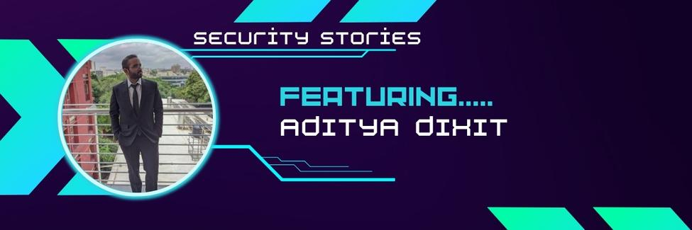

# SecurityStories - 52 Weeks, 52 Stories

## Story - 8: Featuring **Aditya Dixit** 

Through the SecurityStories series, Today, we are excited to bring forward the story of Aditya Dixit, a highly skilled ethical hacker from India who is working to modernize Web3 Security and traditional pentest. So let's jump straight into learning more about him and from his experience. 

### **Question:** Could you briefly introduce yourself? 

**Aditya:** I'm leading the Research at CredShields, and the Pentest teams at Cobalt Labs and HackerOne. I love taking things apart, and I'm glad I get to do this as a full-time job. 

At CredShields, we work on Smart Contract Security, Audits, and automation & research on SolidityScan. In my other two positions, I lead teams of pentesters in delivering high-quality pentest services to our clients.

### **Question:** How did you get started in Cyber Security?

**Aditya:** I was fortunate enough to know Shashank since we were kids. He introduced and taught me hacking and bug bounties in 2012-13. I was intrigued by the fact that you could earn just by hacking into websites and securing them simultaneously. I started with Bugcrowd back in the day. 

### **Question:** What were the initial challenges and blockers you faced? 

**Aditya:** During that time, there was a shortage of publicly available resources and limited awareness. Initially, there was not much support for this type of work, there was a negative stigma attached to hacking, and it was often viewed as an illegal activity.

However, as people began to recognize its value in helping organizations identify and fix vulnerabilities in their systems, their perception began to shift, creating many job opportunities.

### **Question:** What is the learning methodology you followed or still follow? 
**Aditya:** To learn new things efficiently, I often read articles or blog posts for quick and detailed information. When I want to delve deeper into a subject, I read books and watch video series, taking notes as I go. Keeping notes is a beneficial practice.

### **Question:** What all certifications do you hold, and what certificates would you recommend to the readers? 

**Aditya:** My first cert was OSCP. I've also done AWS Cloud Practitioner and Security Specialty. 
There are numerous certificates available, each with its own syllabus. The specific certificate a person chooses will depend on their needs and interests.

### **Question:** What is your favourite thing to hack on?

**Aditya:** My favourite things to hack on are the Web apps, Android apps and Smart Contracts.

### **Question:** What does your tool arsenal look like - Could you share some?

**Aditya:** I'm not much of a tool connoisseur. I use most of the tools widely used by others in the field. This includes tools from Project Discovery's arsenal, Amass, tools by tomnomnom, hakluke, passive sources like Shodan and Censys, port scanners like nmap and masscan, ffuf for fuzzing, and of course, The Burp Suite and its plugins. 

### **Question:** How do you cope with Burn Outs?

**Aditya:** Take a break, go out, go to the gym, listen to music, and read books. Just make sure you're not constantly looking at your screen. I play guitar. Music always helps.

### **Question:** What would you advise the newcomers in Cyber Security?

**Aditya:** For all the OSCP enthusiasts out there, Try Harder! It's always challenging, but I promise it gets easier as you go. 
Keep yourself updated with the current trends, events, and hacks in the field, and read blogs and articles published by others. Do write-ups of your own findings and research.

### **Question:** How do you keep up with the latest trends in Cyber Security - Could you share your go-to resources? 

**Aditya:** Twitter is my go-to source. I also follow newsletters and blogs, such as SolidityScan,  Blockthreat, Portswigger, and Intigriti. 

HackTricks and PayloadAllTheThings are incredible when I need to look for anything specific during my pentests. 

### **Question:** What's your life outside hacking?

**Aditya:** I like automating things and building tools that make my work easier. Your brain is for having ideas, not storing them. Organize your workflow, so you spend less time de-cluttering it. 

I also learn and play guitar, read many novels, and give myself a break on weekends. 

### Social Profiles
- Blog: http://blog.dixitaditya.com/
- Twitter: https://twitter.com/zombie007o
- LinkedIn: https://www.linkedin.com/in/ad17ya/

> Did you find Aditya's story interesting and inspiring? Please share it with your friends and colleagues to spread the word. 

> We will be coming up with more exciting and inspiring stories Weekly.

Follow Me on [Twitter](https://www.twitter.com/harshbothra_)