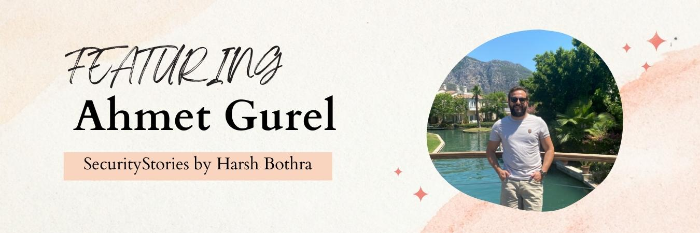

# SecurityStories - 365 Days, 365 Stories 

## Story - 1: Featuring **Ahmet Gurel** 

Through SecurityStories series, Today, we are excited to bring forward the story of Ahmet Gurel who is a highly skilled ethical hacker from Turkey. Let's jump straight into learning more about him and from his experience. 

### **Question:** Could you briefly introduce yourself? 

**Ahmet:** I'm a Senior Security Expert who performs pentest and source code analysis for Web, Mobile, Desktop, and Cloud applications. Also, I have knowledge and know-how about network protocol analysis, network & application security issues, exploiting, and vulnerability research. I have 7+ years of offensive security work experience, and I am currently working as a Senior Penetration Tester in a Bank. Apart from that, I have been actively involved in Bug bounty and Pentest as a Service projects for 3+ years.

- https://app.cobalt.io/agurel
- https://bugcrowd.com/ahmet
- https://acropolis.synack.com/inductees/AhmetG/

### **Question:** How did you get started in Cyber Security?

**Ahmet:** Like many people at a young age, my acquaintance with the computer was through games. I have a story that starts with wondering how the online games I play are made, and then continues with detecting the security vulnerabilities of these games. I think that was the beginning of my career.

In the following years, I have been dealing with software and cyber security without realizing it. This interest continued when I studied computer engineering at university and became acquainted with ethical hacking there.

### **Question:** What were the initial challenges and blockers you faced? 

**Ahmet:** Since I started at a young age, there were not many resources in my mother tongue about these fields at that time. I did not know English as I was a young age. I think that was the biggest challenge for me. That's why I think I love to share what I've learned. And I produce resources with Turkish content. I have a cyber security book I wrote in this field and a video course on mobile application security. It is among the things that excite me that young people are starting out in this field.

### **Question:** What is the learning methodology that you followed or that you still follow? 
**Ahmet:** I'm a little too detailed when learning something new. First, I examine the documentation, if any, about that technology/subject. Then, if there are sub-topics that will be required for that subject, I research/learn them. Finally, I review the articles and projects written on the subject. (Google, Medium, GitHub, etc.)

### **Question:** What all certifications do you hold, and what all certificates you would recommend to the readers? 

**Ahmet:** I have CompTIA Security+, eWPTXv2, eMAPT, CRTP, CEHv10, and ISO/IEC 27001 Lead Auditor certificates.

Actually, the proposal of the certification is somewhat open-ended. I think it has to do with the person's learning model. If you like a hands-on learning model with practice, Offensive Security and eLearnSecurity certificates may be for you, but if you are someone who likes to learn from documentation and written sources and solve questions in this way, SANS and EC-Council certificates may be for you. I can really recommend eWPTXv2 documents, lab, and exam for people who want to improve themselves in the field of web application security.

### **Question:** What is your favourite thing to hack on?

**Ahmet:** My favorite areas of hacking are generally web and mobile apps. I really like to change things in applications, to do things without authorization. :D

### **Question:** What does your tool arsenal look like - Could you share some?

**Ahmet:** I'm not someone who uses a lot of tools. I use manual analysis and known basic methods and tools. But recon is really an important part of my testing. 

Tool Kit List: gobuster, ffuf, subfinder, gau, httpx, nuclei, nmap, Burp Suite Pro and plugins <3. 

### **Question:** How do you cope up with Burn Outs?

**Ahmet:** I am trying to make my working moment enjoyable in an intense working tempo. Working to the accompaniment of my favorite music, picking up my guitar when I take a break in my study, are some of them. But my biggest supporter has always been my wife.

### **Question:** What would you advise the newcomers in Cyber Security?

**Ahmet:** I can always recommend newbies to explore their favorite field and study hard, giving themselves time for basic and advanced technical knowledge in this field. But recently, many questions and e-mails come to me in the Bug Bounty field and only money-oriented questions. I think when you love this job and give your long hours and years, money is just one of the results. I think that the probability of being successful in a field and subject that you do not like just for money will be low.

### **Question:** How do you keep up with the latest trends in Cyber Security - Could you share your go-to resources? 

**Ahmet:** In fact, I follow new security research and vulnerabilities. Apart from that, I follow my friends who are active on bug bounty/pentest platforms. I follow the bugs and methods that they think are interesting from their blog or Twitter posts.

- https://thehackernews.com/
- https://www.reddit.com/r/netsec/
- https://www.reddit.com/r/Pentesting/
- https://twitter.com/hashtag/BugBountyTips

### **Question:** What's your life outside hacking?

**Ahmet:** Apart from hacking, I am someone who likes to spend time with my family and friends. I like an active life such as camping, trekking, fishing, and going to concerts. Apart from these, I love to discover new dishes and cuisines. I think it helps me clear my head and work more focused.

### Social Profiles
- Blog: https://gurelahmet.com/ 
- GitHub:  https://github.com/ahmetgurel 
- Twitter: https://twitter.com/ahmettgurell
- LinkedIn: https://www.linkedin.com/in/ahmetgurell
- Exploit-DB: https://www.exploit-db.com/?author=8736 

[Twitter Thread]()

> Did you find Ahmet's story interesting and inspiring? Make sure to share it with your friends and collegeus to spread the word. 

> We will be coming with more such interesting and inspiring stories daily.

Follow Me on [Twitter](https://www.twitter.com/harshbothra_)