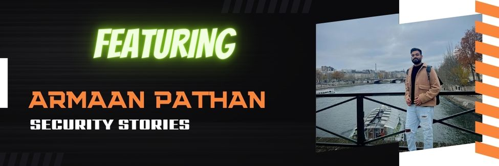

# SecurityStories - 52 Weeks, 52 Stories

## Story - 18: Featuring **Armaan Pathan** 

Through the SecurityStories series, Today, we are excited to bring forward the story of Armaan Pathan, who is currently working as a Senior Security Engineer and is well known for his exciting research and bug bounty work.

### **Question:** Could you briefly introduce yourself? 

**Armaan:** Greetings, I'm Armaan. I currently hold the position of a senior security engineer at Certus Cybersecurity. I also have around eight years of expertise in bug bounty,  and I am always eager to expand my knowledge. Besides that, I am passionate about travelling the globe and immersing myself in diverse cultures.

### **Question:** How did you get started in Cyber Security?

**Armaan:** My parents discontinued our internet connection due to my poor performance in 10th grade. I had to go to my friend's house to use Facebook. During that time, my friend used a Firefox plugin to capture all Facebook cookies. He took advantage of this, gained access to my account, and sent messages to my contacts without my knowledge. Initially, I contemplated retaliating by hacking into his account, but instead, I became fascinated with cybersecurity and began exploring various types of vulnerabilities and related topics.

### **Question:** What were the initial challenges and blockers you faced? 

**Armaan:** After completing 12th grade, my parents took a new internet connection, but unfortunately, the speed was only 1 Mbps, and my computer had an Intel Pentium 3 CPU, which was slow and too lagging. Furthermore, The internet had limited resources for learning about new vulnerabilities.

### **Question:** What learning methodology did you follow or still follow? 
**Armaan:** During my early days in cybersecurity, I joined various cybersecurity groups on Facebook to learn more. Through one of these groups, I learned about multiple types of cyber attacks, including injection-related ones. In addition, I read several books, such as Linux Basics, Nmap Documentation, and The Web Application Hacker's Handbook. After completing a topic, I used to perform test cases on websites with vulnerability disclosure programs.

My approach to learning in cybersecurity involves the following:
Solving labs on Pentesterlab.
Regularly reading blogs.
Connecting with cybersecurity professionals and bug hunters to discuss new topics and attack scenarios.
Additionally, I participate in bug bounty programs to gain insight into new technologies.

### **Question:** What all certifications do you hold, and what certificates would you recommend to the readers? 

**Armaan:** While I hold the OSCP certification, I recommend becoming a member of Hackthebox, Pentesterlab, and Appsecengineer.com for individuals looking to enter the cybersecurity field. These websites provide ample materials to help you gain knowledge and stay up-to-date in the area without needing to pursue certifications.

### **Question:** What is your favourite thing to hack on?

**Armaan:** My preference lies in application security hacking encompassing web, mobile, and APIs. I prefer applications with multiple roles and modules and various web services in the backend, as they typically provide significant scope to execute diverse test cases. Moreover, regarding bug bounties, I am not one to constantly switch between different programs. Instead, I concentrate on a single program for 3-4 years and remain vigilant for any updates, such as changes to the UI, If the company has introduced any new modules etc.

### **Question:** What does your tool arsenal look like - Could you share some?

**Armaan:** Although I don't do reconnaissance and depend on myself for the tools, I do use several tools such as httpx, katana, nuclei, naabu, and sqlmap. Additionally, I utilize active and passive scans within the burp suite and certain plugins such as reflector, para minor, IP rotate, and custom macros to conduct access control-related test cases.

### **Question:** How do you cope with Burn Outs?

**Armaan:s** In the past, burnout used to have a very negative effect on me. However, I've since discovered that I can overcome burnout by taking vacations every three months to different countries, listening to music, shopping, and spending quality time with loved ones.

### **Question:** What would you advise the newcomers in Cyber Security?
**Armaan:** If you're new to cybersecurity, it's recommended that you attempt to solve a few CTF challenges per week on various platforms like Hackthebox and Pentesterlab. As for those who aspire to become bug bounty hunters, please don't get discouraged by encountering N/A and duplicate situations, as even top bug bounty hunters have faced such challenges in their careers. 

### **Question:** How do you keep up with the latest trends in Cyber Security - Could you share your go-to resources? 

**Armaan:** In my approach, I explore diverse technologies, such as understanding how certain JavaScript functions work within a web page, how developers implement them, and how attackers can exploit them. I keep up-to-date by following multiple researchers on Twitter and regularly practice my skills by completing labs on PentesterLab.

### **Question:** What's your life outside hacking?

**Armaan:** Besides hacking, I enjoy spending quality time with my friends and family, exploring various destinations, trying diverse cafes, savouring delicious cuisine, and listening to music.

### Social Profiles

- Twitter: https://twitter.com/armaancrockroax
- LinkedIn: https://www.linkedin.com/in/armaan-pathan/

> Did you find Armaan's story interesting and inspiring? Please share it with your friends and colleagues to spread the word. 

> We will be coming up with more exciting and inspiring stories Weekly.

Follow Me on [Twitter](https://www.twitter.com/harshbothra_)