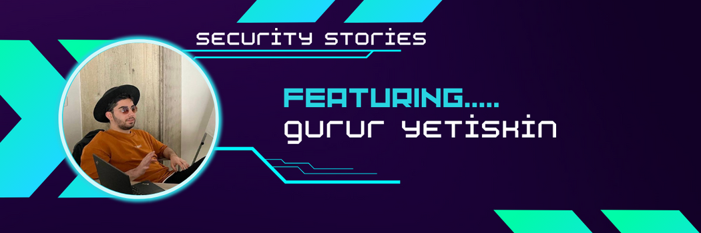

# SecurityStories - 52 Weeks, 52 Stories

## Story - 11: Featuring **Gurur Yetiskin** 

Through the SecurityStories series, Today, we are excited to bring forward the story of Gurur Yetiskin, a seasoned security researcher from Turkey. So let's jump straight into learning more about him and from his experience. 

### **Question:** Could you briefly introduce yourself? 

**Gurur:** Hello, I am Gurur Yetiskin. I have been doing research on cyber security since 2017. As of 2019, I have been working professionally in cyber security. I am a senior cyber security consultant and lead the application security team. In my spare time, I do security research on bug bounty platforms.

### **Question:** How did you get started in Cyber Security?

**Gurur:** After studying in Belgium and France in 2017, I started to be interested in cyber security, but I can say that I encountered the sector literally during my university years. After taking lessons from great names such as Özgür Alp, Ali K. and Tayfun Acarer during my university education, I quickly started cyber security.

### **Question:** What were the initial challenges and blockers you faced? 

**Gurur:** Finding the right resource among all the resources on the internet. There are thousands of sources, true or false, so sometimes I have trouble finding the right source.

### **Question:** What learning methodology did you follow or still follow? 
**Gurur:** My methodology is first to understand the vulnerability and why. Then I read all the public articles and posts about this vulnerability online. Finally, after reviewing all the information, I start hunting. Reading through all the resources and general bug bounties about the vulnerability takes a long time. Still, when I come across something I've read during testing, knowing what to do is an incredible feeling.

### **Question:** What all certifications do you hold, and what certificates would you recommend to the readers? 

**Gurur:** I currently have OSWP, CEH and MCP certificates. I am an active OSWE student and will take the OSWE exam this year. Since I work on web application security, I recommend OSWA and OSWE certificates. OSWA may be more accurate for beginners. I love Offensive Security resources.

### **Question:** What is your favourite thing to hack on?

**Gurur:** I love account takeover vulnerabilities. Generally, the first thing I look for in an application is logical errors that disrupt the workflow.

### **Question:** What does your tool arsenal look like - Could you share some?

**Gurur:** Burp Suite, nmap, and subfinder I use classic subdomain tools like.

### **Question:** How do you cope with Burn Outs?

**Gurur:** I usually take a short break and focus on the things I love.

### **Question:** What would you advise the newcomers in Cyber Security?

**Gurur:** I can say this for those who want to advance in the bug bounty area. I recommend not looking for any vulnerabilities without knowing all the vulnerabilities. This was my biggest mistake when I started because I only knew the basic vulnerabilities. So I only started looking for them in bug bounty programs, but naturally, I failed, which caused my morale to deteriorate. After you have mastered all the vulnerabilities, starting hunting will be much more helpful.

### **Question:** How do you keep up with the latest trends in Cyber Security - Could you share your go-to resources? 

**Gurur:** I follow new security research and follow up-to-date bug bounty writeups.

### **Question:** What's your life outside hacking?

**Gurur:** I love listening to music and exploring new places. Whenever I have time, I go to concerts and places I have never been to.

### Social Profiles
- Twitter: https://twitter.com/gy3tiskin
- Linkedin: https://www.linkedin.com/in/gyetiskin/
- Website: https://gyetiskin.com

> Did you find Gurur's story interesting and inspiring? Please share it with your friends and colleagues to spread the word. 

> We will be coming up with more exciting and inspiring stories Weekly.

Follow Me on [Twitter](https://www.twitter.com/harshbothra_)