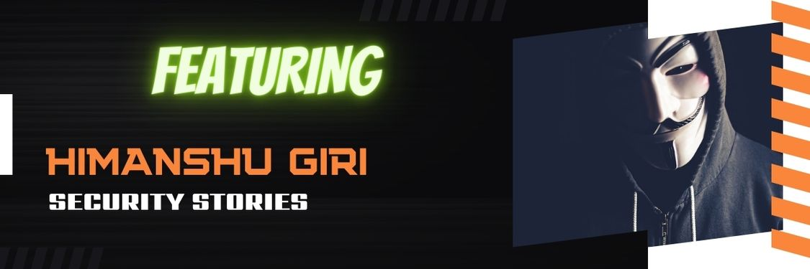

# SecurityStories - 52 Weeks, 52 Stories

## Story - 12: Featuring **Himanshu Giri** 

Through the SecurityStories series, Today, we are excited to bring forward the story of Himanshu Giri, a full-time bug bounty hunter and pentester from India. So let's jump straight into learning more about Himanshu's experience. 

### **Question:** Could you briefly introduce yourself? 

**Himanshu:** I am working as a full time lead pentester at Cobalt and part time pentester at Synack. I  have 4+ years of experience in Information Security & Penetration Testing with expertise in Web, Network, Thick Client, and Mobile Application Security. As per the 2020-21 and 2021-22 assessment I was recognized as an Olympian and Hero rank (https://acropolis.synack.com/inductees/himanshugiri/) by Synack Red Team.

### **Question:** How did you get started in Cyber Security?

**Himanshu:** I started my security career when my father bought a new laptop back in 2011 and my laptop automatically got connected with a open wifi  network and after that I researched about the wifi hacking etc. that's how I got the initial kickoff.

### **Question:** What were the initial challenges and blockers you faced? 

**Himanshu:** During my initial days there were no mind-maps, courses and active community.

### **Question:** What learning methodology did you follow or still follow? 
**Himanshu:** Hack The Box Walkthroughs (IppSec - YouTube videos) and Twitter and community blog-posts.

### **Question:** What all certifications do you hold, and what certificates would you recommend to the readers? 

**Himanshu:** I currently don't hold any certifications. However, OSCP and PNPT are good choices.

### **Question:** What is your favourite thing to hack on?

**Himanshu:** External Networks and Web Application

### **Question:** What does your tool arsenal look like - Could you share some?

**Himanshu:** ProjectDiscovery, Tomnomnom all tools,Burp-suite and some custom made one-liner scripts.

### **Question:** How do you cope with Burn Outs?

**Himanshu:** Weekends car rides and bike ride.

### **Question:** What would you advise the newcomers in Cyber Security?

**Himanshu:** Understanding of Networking Concepts and Web application development idea from front-end to backed will help in a long run.

### **Question:** How do you keep up with the latest trends in Cyber Security - Could you share your go-to resources? 

**Himanshu:** I mostly use Twitter to be updated. 

### **Question:** What's your life outside hacking?

**Himanshu:** Outside hacking I love to play computer games, car driving, bike riding etc.

### Social Profiles
- LinkedIn: https://linkedin.com/in/himanshu-giri-6b7131ba 
- Twitter : https://www.twitter.com/h0i0m0a0n0s0h0u

> Did you find Himanshu's story interesting and inspiring? Please share it with your friends and colleagues to spread the word. 

> We will be coming up with more exciting and inspiring stories Weekly.

Follow Me on [Twitter](https://www.twitter.com/harshbothra_)