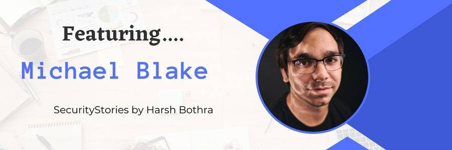

# SecurityStories - 52 Weeks, 52 Stories

## Story - 13: Featuring **Michael Blake** 

Through the SecurityStories series, Today, we are excited to bring forward the story of Michael Blake, a seasoned application security engineer from United States and a top bug bounty hunter. So let's jump straight into learning more about Michael's experience. 

### **Question:** Could you briefly introduce yourself? 

**Michael:** My name is Michael Blake. I am an application security engineer and a bug bounty hunter. 

### **Question:** How did you get started in Cyber Security?

**Michael:** Cyber security was an interest I accidentally discovered. When I was a kid, I played quite a few video games. One of the things I loved doing what looking up bugs / glitches in games or trying to discover my own. I loved getting out of maps or doing anything I wasn't meant to be able to do. This later turned into modding video games, which then led me to hacking and security.  

### **Question:** What were the initial challenges and blockers you faced? 

**Michael:** My technical knowledge was fairly limited when I was learning how to hack. I was still in high school and only just learning how programming works. Hacking was still a mostly black-hat activity at the time with bug bounty programs just in their infancy. So there weren't nearly as many resources as there are today. 

### **Question:** What learning methodology did you follow or still follow? 
**Michael:** I only learn by doing. I can read blog posts all day long, but it doesn't really click until I exploit the bug myself. 

### **Question:** What all certifications do you hold, and what certificates would you recommend to the readers? 

**Michael:** I have a degree is software engineering. No certifications. The degree helped me get my foot in the door with becoming a web developer. Being a web developer (and doing bug bounties as a hobby) got my foot in the door to become an appsec engineer. 

### **Question:** What is your favourite thing to hack on?

**Michael:** Web applications. I don't think I've narrowed it down further than that. Once I find a thread to pull on, I will stick there for as long as I can. 

### **Question:** What does your tool arsenal look like - Could you share some?

**Michael:** My tool arsenal changes constantly. Sometimes I'm running custom tools hoping to find some bugs through automation. Sometimes, I'm running nothing but ffuf and Burp Suite. It depends what target I'm hacking. 

### **Question:** How do you cope with Burn Outs?

**Michael:** I don't really have any method of dealing with burn outs. I hack as a hobby and as a second income source, so I typically just hack when I have time and when it sounds entertaining to me. 

### **Question:** What would you advise the newcomers in Cyber Security?

**Michael:** Everyone is different. Do what works for you. Find what you enjoy and become good at that. Successful people in this field often have their own niches. 

### **Question:** How do you keep up with the latest trends in Cyber Security - Could you share your go-to resources? 

**Michael:** I mainly just stay on Twitter to keep up with cyber security trends. Other than that, some podcasts such as Darknet Diaries and Malicious Life.

### **Question:** What's your life outside hacking?

**Michael:** A full time job plus hacking keeps me pretty busy. Outside of this, other hobbies of mine include: golfing, hiking, photography, and astrophotography.

### Social Profiles
- Twitter: https://twitter.com/Michael1026H1
- LinkedIn: https://www.linkedin.com/in/michael-blake-oit/

> Did you find Michael's story interesting and inspiring? Please share it with your friends and colleagues to spread the word. 

> We will be coming up with more exciting and inspiring stories Weekly.

Follow Me on [Twitter](https://www.twitter.com/harshbothra_)