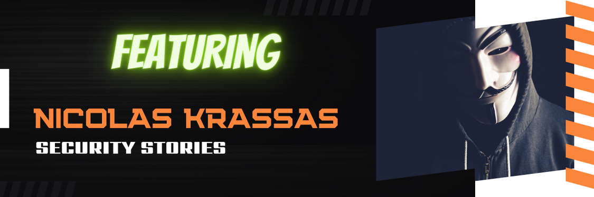

# SecurityStories - 52 Weeks, 52 Stories

## Story - 9: Featuring **Nicolas Krassas** 

Through the SecurityStories series, Today, we are excited to bring forward the story of Nicolas Krassas, an OG hacker and active community contributor from Switzerland with experience since the era when internet speeds were measured in kbps, with his first computer being an Amiga 500. So let's jump straight into learning more about him and from his experience. 

### **Question:** Could you briefly introduce yourself? 

**Nicolas:** I'm a senior penetration tester and your friendly security guy. I like to assist people with security questions and guide them through a solution. I come from an era where internet speeds were measured in kbps, with my first computer being an Amiga 500. 

### **Question:** How did you get started in Cyber Security?

**Nicolas:** Whilst working as a member of the support team on a local Internet Service Provider in the year 1998, I came up with a logical security issue at that time which was allowing users to login into the Annex ( modem installation ) and authenticate without username/password combination. The case fascinated me, and I started looking more towards security issues, exploits and misconfigurations.

### **Question:** What were the initial challenges and blockers you faced? 

**Nicolas:** At that time, the initial challenges were the difficulties of looking for information. There were several underground security groups/teams where information was exchanged, but it wasn't easy to be part of them while you were starting this path.

### **Question:** What learning methodology did you follow or still follow? 
**Nicolas:** The process has been the same through the years, continuous education. I collect information and security posts from various sources daily, which I will read and practice when techniques seem essential for my work.

### **Question:** What all certifications do you hold, and what certificates would you recommend to the readers? 

**Nicolas:** I have held CISSP certification for the last eight years. Certificates of any sort are not in my mentality. I won't say they are unsuitable for starting people, but they are not the result. Certifications are a 'nice to have' for people trying to find a job and learn towards a career path. However, they are not an absolute measure of knowledge and shouldn't be measured as one. The popular ones in our career path will be OSCP and HTB CPTS. Ultimately, what will make a difference is how much time one will spend on a topic and how much he will pursue a path with constant effort.

### **Question:** What is your favourite thing to hack on?

**Nicolas:** I love working on internal/external host targets. I'm more focused on service exploitation rather than web applications.  

### **Question:** What does your tool arsenal look like - Could you share some?

**Nicolas:** I will use nmap or rumble/runzero, httpx from project discovery, nuclei with custom templates, of course, Burp suite proxy, sqlmap and a few custom python scripts build through the years.

### **Question:** How do you cope with Burn Outs?

**Nicolas:** I had the opportunity to work in different IT positions (sysadmin/network admin/security) through the years. When I feel tired, I will focus on another area.

### **Question:** What would you advise the newcomers in Cyber Security?

**Nicolas:** The main advice I can share is don't give up and keep learning. People starting now in Cyber Security are often lured by posts that appear with high payouts from security bounties or positions. These are not the norm. These cases should be treated as exceptions. Cyber Security path takes time, and it's a process without end. There won't be a moment that one could say now I know all, or even I know enough. There is always more to learn. 

### **Question:** How do you keep up with the latest trends in Cyber Security - Could you share your go-to resources? 

**Nicolas:** I keep a relatively large RSS feed repository with more than 800 feeds from where I will select items that I believe are essential and relevant for me to read daily.

### **Question:** What's your life outside hacking?

**Nicolas:** As a family person, I will try to keep a tight schedule in my daily life. I keep a routine exercise schedule of 4 days during the week with a mix of weight/cardio training. My job is also my hobby, and with kids, I will spend most of my time reading by now having their daily schedule and being independent. 

### Social Profiles
- LinkedIn: https://www.linkedin.com/in/nicolas-krassas-8409876/
- Twitter: https://twitter.com/Dinosn

> Did you find Nicolas's story interesting and inspiring? Please share it with your friends and colleagues to spread the word. 

> We will be coming up with more exciting and inspiring stories Weekly.

Follow Me on [Twitter](https://www.twitter.com/harshbothra_)