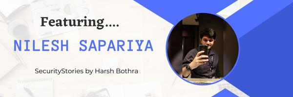

# SecurityStories - 52 Weeks, 52 Stories

## Story - 3: Featuring **Nilesh Sapariya** 

Through the SecurityStories series, Today, we are excited to bring forward the story of Nilesh Sapariya, a highly skilled penetration tester from India who currently resides in UAE. So let's jump straight into learning more about him and from his experience. 

### **Question:** Could you briefly introduce yourself? 

**Nilesh:** I am Nilesh Sapariya, and I have worked in cybersecurity for the past ten years. My primary area of expertise is application security. However, I am always eager to learn new things. Despite having a decade of experience in my field, I still consider myself a beginner. The cyber security domain is vast and ever-evolving, making it exciting and challenging to stay ahead of the curve. 

I am an active member of the cybersecurity community (Null), engaging in bug bounty, CTF, and other security-based activities. In addition, I am part of the Cobalt Core and Synack Red Team, helping to identify and mitigate security vulnerabilities. Doing good and helping each other are essential to our success. 

### **Question:** How did you get started in Cyber Security?

**Nilesh:** When I was in 2nd year of engineering, our college got an invitation from a nearby college with multiple events organized. One of the events was "Ethical Hacking," which fascinated me a lot, and without a second thought, I decided to participate. In this event, the speaker presented two laptops and demonstrated how he gained access to the other laptop from his machine via some graphic representation. I am still unable to figure out how he did that, but this particular demonstration was the turning point of my life, and I decided to dive deep into it. After completing my engineering, the journey was rock bottom. It's not easy for everyone to get a job with a low academic score in engineering.

I was one of them. I applied for jobs, attended many walk-in interviews, and got my first job in the networking field as a network engineer. I knew this was not my path, and my mind was still on ethical hacking. I used to work from 9 am to 6 pm (we did not have Saturday and Sunday off). I utilized my post-working hours to study ethical hacking and started researching it. I still remember reading the theory and trying to visualize how virtual machines work to set up Kali Linux, and then I started practising. Finally, after learning for all these years, my hard work paid off.

I reported a vulnerability in Microsoft and got into their Hall of Fame list. That's it. Then the journey of becoming an ethical hacker started. After that, I never looked back. I got many halls of fame in top-notch organizations. During this period, I got invitations from various top engineering colleges in Mumbai (India) to conduct workshops on Ethical Hacking. I decided to share this knowledge without any monetary reward to help beginners. I have undertaken many talks at various colleges, which can be found here. So, with this knowledge, skills, and many HOF, I got my first job in Cyber Security in 2013.

### **Question:** What were the initial challenges and blockers you faced? 

**Nilesh:** Initially, I faced many challenges and blockers when starting my cyber security career. I needed to figure out where to start or what to read and which path to follow. I had to go through a lot of trial and error before finding my footing. I did a lot of research and dedicated a lot of time to understanding the basics of cyber security, learning the different tools and techniques, and developing my skillset.

I had to take a lot of risks and also face a lot of failures before I eventually found success. However, I overcame the initial challenges and blockers through dedication, hard work, and perseverance and became a successful cybersecurity specialist. All thanks to the people who supported me during this journey, including my mentors, and obviously, god's grace is a must. 

### **Question:** What is the learning methodology you followed or still follow? 
**Nilesh:** The learning methodology I have followed for cyber security combines self-learning and hands-on experience via the PortSwigger lab. I have been researching and reading about the different concepts and tools used in cybersecurity and also attending online courses and workshops. Additionally, I have been participating in online CTFs (Capture the Flag) to develop my skills.

### **Question:** What all certifications do you hold, and what certificates would you recommend to the readers? 

**Nilesh:** I currently hold several certifications in cybersecurity, including 

- Offensive Security Certified Professional (OSCP)
- Offensive Security Wireless Professional (OSWP)
- Certified Red Team Professional (CRTP)
- Certified Ethical Hacker (CEH) v8
- Certified Blockchain Expert
- AWS Certified Cloud Practitioner
- Microsoft Certified: Azure Fundamentals (AZ-900)
- Microsoft Certified: Azure Security Engineer Associate (AZ-500)

Readers should select a certification in the area of cyber security that is most suitable for their goals. For instance, the Offensive Security Certified Professional (OSCP) certification is popular for those specialising in offensive security. In contrast, the Certified Red Team Professional (CRTP) certification suits those interested in red teaming.

### **Question:** What is your favourite thing to hack on?

**Nilesh:** I like exploring all targets: web applications, APIs, mobile, networks, etc. But if I want to pick the best target, it will always be "web application".

### **Question:** What does your tool arsenal look like - Could you share some?

**Nilesh:** My go-to tools for the recon process are:
- dirserach
- dirb
- Nikto
- ffuf 
- Nuclei
- Sublist3r etc. (There are many, but usually these are go-to tools)

For Web Application Testing, my go-to tools are:
- Burp Suite Professional and its some excellent extensions such as (AutoRepeater, JS Link Finder, Error Message Check etc. ) 

For Network Penetration Testing usually, my go-to tools are:
-  Kali Linux
-  Nessus Professional

Many tools might not be mentioned here, but the above is just a high-level view of the essential tools in my day-to-day engagements. 

### **Question:** How do you cope with Burn Outs?

**Nilesh:** Burnout in cyber security and bug bounty can be a challenge, but there are some steps which I usually follow: 

1. Take Breaks: Take regular breaks throughout the day to give your mind and body a rest. Even if it's just 10 minutes, take a step away from your work and relax.

2. Set realistic goals: Setting realistic goals and not trying to do too much can help you avoid Burnout. Break your tasks into manageable parts and focus on one task at a time. Remember to reward yourself when you reach a goal.

3. Exercise Regularly: Exercise is a great way to reduce stress and increase energy levels. Take Time to go for a walk, bike ride, or even do some stretching or yoga.

4. Eat Healthily: Eating a healthy diet is essential for overall health and can help your mind and body stay energized.

5. Find a Mentor: Find someone in the cyber security and bug bounty community who you can look up to and learn from. Having a mentor can keep you motivated and inspired.

6. Take Time off: It's essential to take some time off every once in a while. Take a day off or a weekend away to relax and recharge your batteries.

### **Question:** What would you advise the newcomers in Cyber Security?

**Nilesh:** I advise newcomers to Cyber Security to start by familiarizing themselves with computer security and the typical online threats. This includes researching and understanding the most common techniques used to exploit vulnerable systems and educating themselves on the different types of vulnerability and how to protect against them. 

I want to highlight a few essential points that newcomers can follow for success:

1. Learn the fundamentals and Educate yourself: Learning about the different aspects of cyber security is the first step to getting started. Take the Time to read up on the different areas of cyber security, including data security, network security, application security, and more.

2. Take advantage of the free resources available over the internet. Many resources provide cybersecurity training and tutorials, so take advantage of them.

3. Get Certified: Getting certified in one or more areas of cyber security is a great way to demonstrate your expertise and stand out in the field. Consider getting certified in CEH,  CISSP, or other popular cyber security certifications.

4. Start Networking: Networking with other cybersecurity professionals is a great way to learn more about the field and stay up to date on the latest trends and technologies. For example, join a local cyber security meetup or attend an industry conference to make contacts. 

5. Join a Cyber Security Community: Cybersecurity communities are a great way to learn from your peers and get advice from experts. Look for local groups or join an online community like Nullmeet. 

6. Keep up with the latest news. Cyber security is constantly evolving, so stay up to date on the latest news and developments in the industry. Again, the best place is Twitter. 

7. Understand the legal and ethical implications of cyber security. Cybersecurity is not just about technology; it is also about understanding the legal and ethical implications of the technology.

6. Develop a cyber security strategy for yourself. Test your skills and knowledge with cyber security challenges and competitions. Portswigger lab is good to start with if you look forward to application security. Likewise, as per your area of interest, find a site which provides free tutorials. 

7. Consider working for a cybersecurity firm or taking an internship.

### **Question:** How do you keep up with the latest trends in Cyber Security - Could you share your go-to resources? 

**Nilesh:** To stay up-to-date on the latest trends in cyber security, I follow security researchers on Twitter. This allows me to stay informed of the most current trends and developments in the field. In addition to that, I use the PortSwigger Web Security Academy to practice different types of attacks.

### **Question:** What's your life outside hacking?

**Nilesh:** Apart from hacking, I am passionate about writing inspiring blogs - https://nileshsapariya.blogspot.com/search/label/Lessons%20Learnt, as well as travelling to new places. 

In my spare time, I share my love of cooking through my food blogging YouTube channel, posting videos of my culinary creations and occasionally vlogging.  - https://www.youtube.com/c/IndianFoodiesExpress  -  
Subscribe to my channel, and I'll give you a virtual hug! ;)  Just kidding, but seriously, it would make me so happy if you subscribed!

### Social Profiles
- LinkedIn: https://www.linkedin.com/in/nileshsapariya/
- Twitter: https://twitter.com/nilesh_loganx
- Blog: https://nileshsapariya.blogspot.com/

> Did you find Nilesh's story interesting and inspiring? Please share it with your friends and colleagues to spread the word. 

> We will be coming up with more exciting and inspiring stories Weekly.

Follow Me on [Twitter](https://www.twitter.com/harshbothra_)