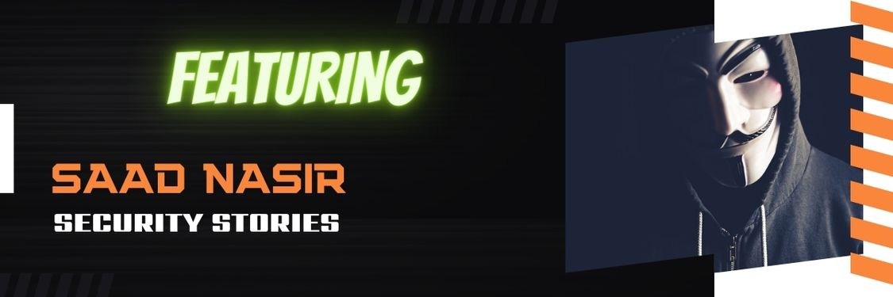

# SecurityStories - 52 Weeks, 52 Stories

## Story - 19: Featuring **Saad Nasir** 

Through the SecurityStories series, Today, we are excited to bring forward the story of Saad Nasir, who is a red teamer and cloud security expert from the United States of America.

### **Question:** Could you briefly introduce yourself? 

**Saad:** Saad is a Red Teamer and Cloud Security Expert with extensive knowledge in network and database administration; he has a wide range of expertise in Red Teaming, Web Applications, and Mobile Pentesting. When Saad is free, you’ll find him working to further his skills, engaging with his local community, and playing golf and cricket.

### **Question:** How did you get started in Cyber Security?

**Saad:** In 2018 I showed interest in Threat Intelligence but ended up choosing Red Teaming as it was more exciting and valuable to me hence started my career in the United States, moving from Information Technology.

### **Question:** What were the initial challenges and blockers you faced? 

**Saad:** Choosing the right domain in cybersecurity was challenging, but the help of a close friend saved me from that part, and I ended up starting my career in Red Teaming.

### **Question:** What learning methodology did you follow or still follow? 
**Saad:** Hands-on methodology, If I see something new to me, I try to do it manually through hands-on even though I have to spend resources. That ensures I am learning and following the right approach toward whatever I am doing.

### **Question:** What all certifications do you hold, and what certificates would you recommend to the readers? 

**Saad:** I hold OSCP, PNPT, EJPT, CYSA+ and AWSASS. My recommendation to the reader is to get any cert that allows you to learn Hands-on expertise. PNPT is one of them to get hold of basics and intermediate operations of penetration and networking test.

### **Question:** What is your favourite thing to hack on?

**Saad:** JWT - abuse of JSON tokens to take over the accounts

### **Question:** What does your tool arsenal look like - Could you share some?

**Saad:** BurpSuite Pro, Open Source Templates, Cobalt Strike, Python Scripts, etc.

### **Question:** How do you cope with Burn Outs?

**Saad:s** Playing Sports, Going out with the family

### **Question:** What would you advise the newcomers in Cyber Security?
**Saad:** I won’t tell somebody to learn this and that, watch this video and try to be hands-on with the operations. This 12 hours video is enough to get a basic understanding of hacking.

https://www.youtube.com/watch?v=fNzpcB7ODxQ

And here is my advice if you are new in the field:

Overcome the fear that you can do it. Listen to everyone but decide what you like and want to proceed with. Don’t just watch how others do it, prepare, build and try to be hands-on to develop your skills.

### **Question:** How do you keep up with the latest trends in Cyber Security - Could you share your go-to resources? 

**Saad:** Hack the Box Challenges, Staying up to date with the CISA handles, following the news using the threat Intel resources.

### **Question:** What's your life outside hacking?

**Saad:** Interesting! Outside of hacking, I love to drive different cars and sports; I am an opening batsman in Cricket and a Golf player. Besides that, I am involved in community events, and I am the founder of Security BSides Albuquerque @BSides_ABQ conference.

### Social Profiles

- LinkedIn: https://www.linkedin.com/in/iamsaadnasir

> Did you find Saad's story interesting and inspiring? Please share it with your friends and colleagues to spread the word. 

> We will be coming up with more exciting and inspiring stories Weekly.

Follow Me on [Twitter](https://www.twitter.com/harshbothra_)