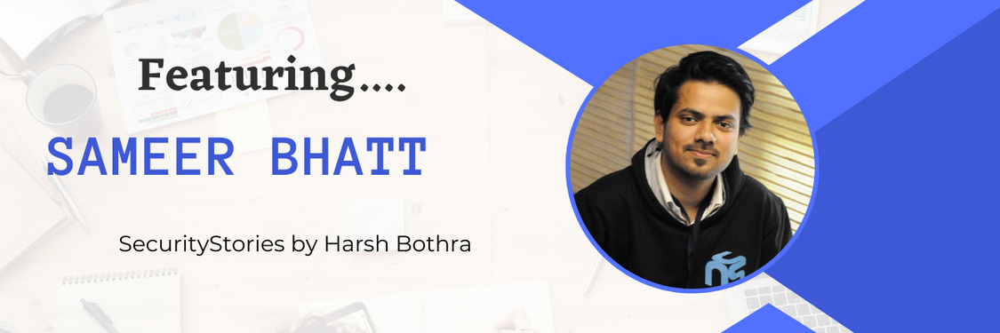

# SecurityStories - 52 Weeks, 52 Stories

## Story - 10: Featuring **Sameer Bhatt** 

Through the SecurityStories series, Today, we are excited to bring forward the story of Sameer Bhatt, a seasoned security researcher and the friendly HackerOne triager who keeps working on your reports. So let's jump straight into learning more about him and from his experience. 

### **Question:** Could you briefly introduce yourself? 

**Sameer:** I'm Sameer Bhatt, known as your friendly Debugger. I'm currently working as a Senior security analyst, but I started my journey in this field as a bug bounty hunter. In these 5+ years of experience, I have been actively involved in bug bounty and penetration testing.

### **Question:** How did you get started in Cyber Security?

**Sameer:** I heard about bug bounty for the first time in 2016 while pursuing my bachelor's degree. I was active and interested in open source contribution, and we organized one security event. In that event, I learned about this particular area of cyber security and started self-learning about it from the internet; 
1. I tried to gather some online courses and resources, i.e., cybrary.
2. I started following security researchers online on social media platforms, solved some CTF challenges and joined conferences/ events to meet more researchers and learn from them. 
3. I met many outstanding researchers from whom I have learned many things. 

In that self-learning phase, I have also started exploring more about bug bounty/ responsible discourses and initiated my bug bounty journey. The first bug I reported was a duplicate; my first bounty was $150.

After completing my bachelor's degree, I started my professional journey as a Security analyst, where I performed pen-testing on various assets and broadened my skill set. Also, I love 💖 doing things for the InfoSec community; Hence I have also started giving talks in local community chapters to share what I learned and to keep learning from others. I also contribute to the community by making Vulnerable Labs and writing blog posts about my research and work.

### **Question:** What were the initial challenges and blockers you faced? 

**Sameer:** Initially, I needed to figure out where to start. Also, more resources were needed on the internet. But In the curiousness to learn something new, I did a lot of research. Later I started with the basic concepts one by one, understanding the different tools/ techniques/ concepts by following some online materials and doing healthy discussions with many researchers, peers and friends online/ offline. Also, I have participated in conferences/ events/ local chapters to develop my skill set.

### **Question:** What learning methodology did you follow or still follow? 
**Sameer:** I believe self-learning is the best way, and whenever I learn something new, I always try to build something out of it and keep notes to track it, i.e., when I started learning python, I started making some tools and attempted to solve some problems. 

### **Question:** What all certifications do you hold, and what certificates would you recommend to the readers? 

**Sameer:** I do not have any certificates yet, and it is more of a personal choice as it will benefit you when you apply for a job as a fresher, but yeah! Knowledge is more important than actual certifications.

### **Question:** What is your favourite thing to hack on?

**Sameer:** Mostly, I hack on Web, API and Mobile, but recently I got interested in game hacking.

### **Question:** What does your tool arsenal look like - Could you share some?

**Sameer:** I do not have a specific list or set of tools, but mainly I do the manual analysis and focus on business logic vulnerabilities by understanding application functionalities. Hence the only tool I always use is Burp Suite.

### **Question:** How do you cope with Burn Outs?

**Sameer:** I do not get burnout quickly because I haven't experienced it yet!! But to refresh my mind I watch anime, play games/ sports, write some poetries or draw something. Also, Sometimes I hang out with my friends/ family and have fun.

### **Question:** What would you advise the newcomers in Cyber Security?

**Sameer:** Keep Improving your observation skill, and do not lose creative thinking. Find your own learning path and create a methodology that keeps you excited and interested in learning new things. 

### **Question:** How do you keep up with the latest trends in Cyber Security - Could you share your go-to resources? 

**Sameer:** Mostly Twitter, by following security researchers, companies and recent vulnerabilities. Apart from that, I also follow my friends, who are active in the cyber security field, to know the bugs and methods they think are interesting from their blog or Twitter posts.

### **Question:** What's your life outside hacking?

**Sameer:** Outside hacking, I watch anime, play games/ sports, and hang out with friends and family!!

### Social Profiles
- Website: https://bhattsameer.github.io/
- Twitter: https://twitter.com/sameer_bhatt5 
- LinkedIn: https://linkedin.com/in/bhatt-sameer
- Github: https://github.com/bhattsameer 
- Instagram: https://www.instagram.com/bhatt_sameer 

> Did you find Sameer's story interesting and inspiring? Please share it with your friends and colleagues to spread the word. 

> We will be coming up with more exciting and inspiring stories Weekly.

Follow Me on [Twitter](https://www.twitter.com/harshbothra_)