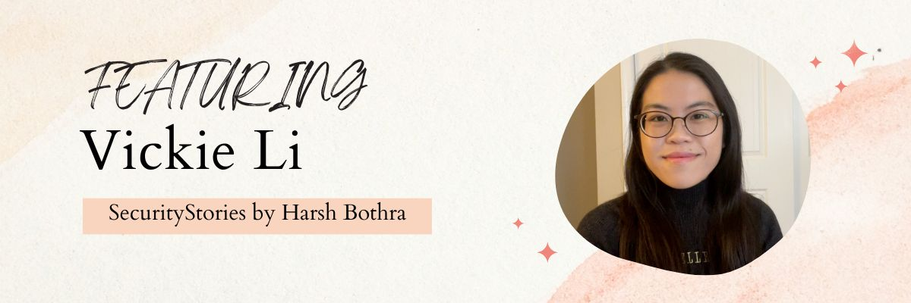

# SecurityStories - 52 Weeks, 52 Stories

## Story - 12: Featuring **Vickie Li** 

Through the SecurityStories series, Today, we are excited to bring forward the story of Vickie Li, a seasoned security researcher from USA and also the author of "Bug Bounty Bootcamp". So let's jump straight into learning more about Vickie's experience. 

### **Question:** Could you briefly introduce yourself? 

**Vickie:** My name is Vickie, and I currently work as a security engineer at Instacart. I am the author of bug bounty bootcamp (https://nostarch.com/bug-bounty-bootcamp). I’ve been working in tech for quite a while now, first starting as a software developer then I transitioned into infosec through bug bounties. 

### **Question:** How did you get started in Cyber Security?

**Vickie:** I started my career in cybersecurity through bug bounty hunting! I’ve done pen testing, consulting, developer advocacy, technical writing, and security engineering since. 

I studies CS in college, and got interested in security through my university courses, and started bug bounties as a way to learn more about infosec. 

Hacking on bug bounty programs helped me learn a lot about web hacking and web application security in general. I started my technical blog, where I wrote about whatever I was learning at the moment. From there I started some freelance penetration testing and technical writing jobs, and eventually landed my current job as a security engineer at Instacart. 

### **Question:** What were the initial challenges and blockers you faced? 

**Vickie:** It’s pretty difficult to get feedback about your work when you are first starting out in bug bounties or cybersecurity. When I first started to hunt on bug bounty programs, I was not sure if I was focusing on the right bugs, if I was assessing business impact properly, etc. Feedback from security engineers managing bug bounty programs was really helpful in helping me refocus my learning. But unfortunately, not every bug bounty program provides good feedback for informational or N/A findings.

### **Question:** What learning methodology did you follow or still follow? 
**Vickie:** Designing a syllabus for myself has helped me learn many skills in tech. Whenever I set out to learn something new, I first define exactly what it is I want to learn, and lay out the intermediate steps that will take me there. Then, I search for resources that will help me accomplish each step in my plan and study those one at a time. For example, if I was a new bug bounty hunter looking to find my first bug, I can first list of the things I need to know to accomplish that:

- How to find web vulnerabilities
- Most common vulnerability types
- How to find IDORs
- How to find XSS
- How to determine a bug’s impact
- How to report vulnerabilities clearly

Once I have my tailored roadmap, I will study these topics one at a time via online blog posts, books, and tutorials. 

### **Question:** What all certifications do you hold, and what certificates would you recommend to the readers? 

**Vickie:** I currently don't hold any certifications. 

### **Question:** What is your favourite thing to hack on?

**Vickie:** I prefer social media sites with complex user interactions. 

### **Question:** What does your tool arsenal look like - Could you share some?

**Vickie:** I no longer spend a lot of time hunting for bug bounties but I used to rely heavily on Burp, and a recon script built around Sublist3r and TruffleHog. I talk more about building a toolkit in my book. In general, I am a fan of learning to do something manually, identify what can be automated in your workflow, then building custom tools to automate that process. 

### **Question:** How do you cope with Burn Outs?

**Vickie:** It’s important to separate your self-worth from your output at work. Bug bounties can be unpredictable: valid reports don’t happen every day, and your earnings can vary from month to month. 
Keep in mind that this happens to everyone, have realistic expectations of what you want to achieve at this stage, and give yourself time to learn something properly. 

### **Question:** What would you advise the newcomers in Cyber Security?

**Vickie:** When approaching someone to be your mentor, think about what you want to get out of the relationship. Are you looking for someone to help you understand a particularly complex bug? Trying to build a faster recon toolset? Think about whether this is something you can accomplish by yourself with some research. Oftentimes, the process of struggling and figuring it out helps you learn deeper than you otherwise would have. Similarly, before asking someone for their strategy for learning programming, bug bounty hunting, or automation: reflect on your current processes, and think whether you can improve them to work better for yourself. Learning a new skill is a personal path. What works for someone else might not work for you.

### **Question:** How do you keep up with the latest trends in Cyber Security - Could you share your go-to resources? 

**Vickie:** I mostly use Twitter to keep myself in the loop. I follow security or software people I have met online or whose blogs I have read. (Check out the amazing folks on my following list!) Security publications like the Daily Swig and tldrsec are pretty amazing too. 

### **Question:** What's your life outside hacking?

**Vickie:** There are a lot of life changes going on in my life right now so unfortunately, I haven’t had much time to pursue hobbies outside of security. But karate and playing with my dog are the main ways I spend my free time. 

### Social Profiles
- Twitter: https://twitter.com/vickieli7 
- Security blog: https://vickieli.dev

> Did you find Vickie's story interesting and inspiring? Please share it with your friends and colleagues to spread the word. 

> We will be coming up with more exciting and inspiring stories Weekly.

Follow Me on [Twitter](https://www.twitter.com/harshbothra_)